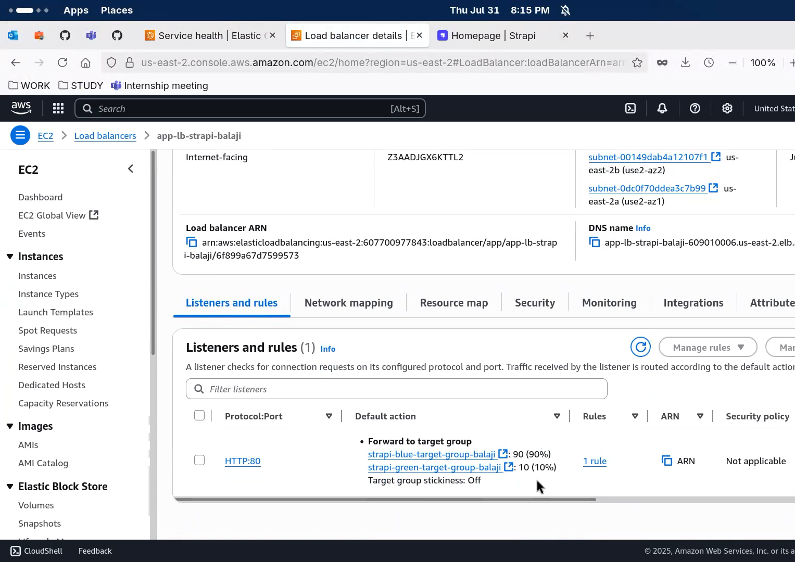
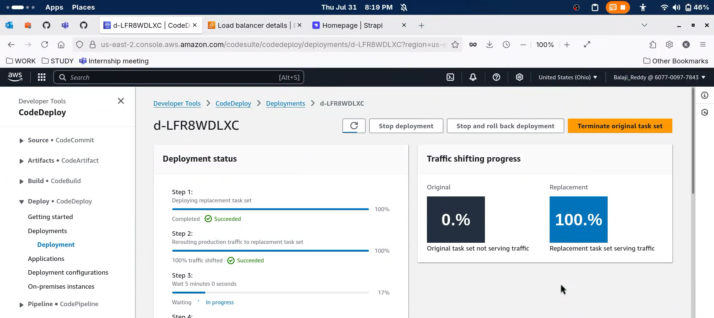
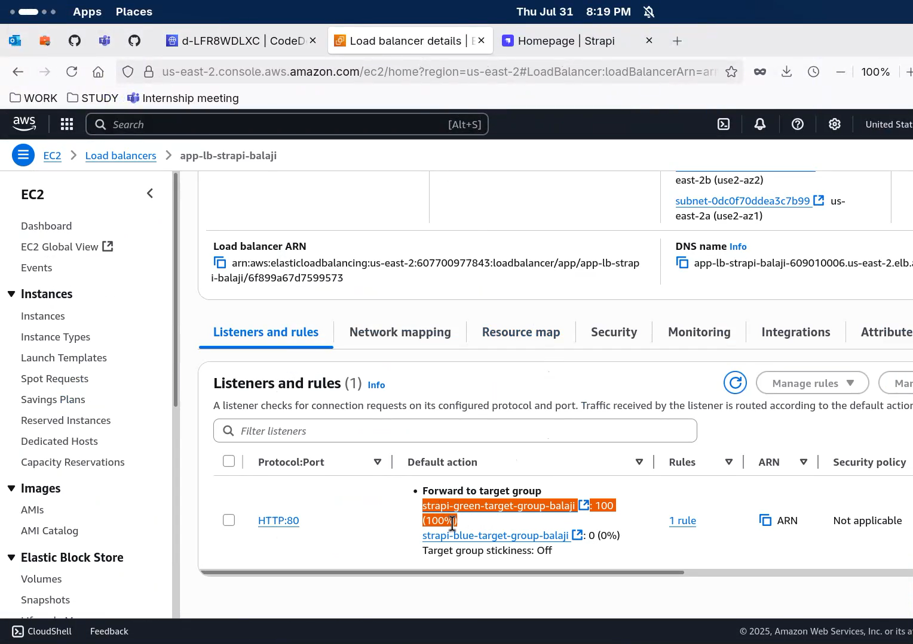

# Strapi Deployment on AWS ECS with Blue/Green Deployment using Terraform and CodeDeploy

This project demonstrates how to deploy a Dockerized Strapi CMS application on AWS ECS Fargate using Blue/Green deployments via AWS CodeDeploy, managed through Terraform.

## Architecture

- **ECS Fargate**: Serverless container hosting for Strapi.
- **Application Load Balancer (ALB)**: Distributes traffic across containers.
- **AWS CodeDeploy**: Manages Blue/Green deployment strategy.
- **Amazon RDS (PostgreSQL)**: Stores Strapi content.
- **Terraform**: Infrastructure as Code for provisioning all resources.


## Prerequisites

- Terraform
- Docker image for Strapi pushed to ECR
- Existing VPC and public/private subnets
- AWS Account

## Deployment Steps

1. **Clone the repository**
   ```bash
   git clone https://github.com/KBALAJI2212/pearlthoughts-strapi.git

    cd pearlthoughts-strapi/_Day-16/terraform
   ```

2. **Initialize Terraform**
   ```bash
   terraform init
   ```

3. **Review and apply the Terraform plan**
   ```bash
   terraform plan
   terraform apply
   ```

4. **Manual Deployment via AWS Console**
   After the infrastructure is set up, go to the **CodeDeploy Console**:
   - Click on your **Application** and then **Deployment Group**
   - Start a **manual deployment**
   - Choose "AppSpec" (See Below)
   - Review and create the deployment.


## AppSpec File

Your `appspec.yaml` should define container name, port, and traffic routes:
```yaml
version: 1
Resources:
  - TargetService:
      Type: AWS::ECS::Service
      Properties:
        TaskDefinition: "strapi-task-definition:revision"
        LoadBalancerInfo:
          ContainerName: "strapi"
          ContainerPort: 1337
```

---


Video Link: [https://youtu.be/YTRdMWq-Q5k](https://youtu.be/YTRdMWq-Q5k)

PR: [https://github.com/PearlThoughts-DevOps-Internship/Strapi--Script-Smiths/pull/2](https://github.com/PearlThoughts-DevOps-Internship/Strapi--Script-Smiths/pull/2)

---

<h2>PROJECT SCREENSHOTS</h2>

<p float="left">
  
  
  
  
  
</p>
